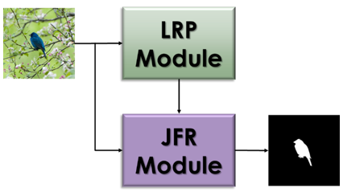
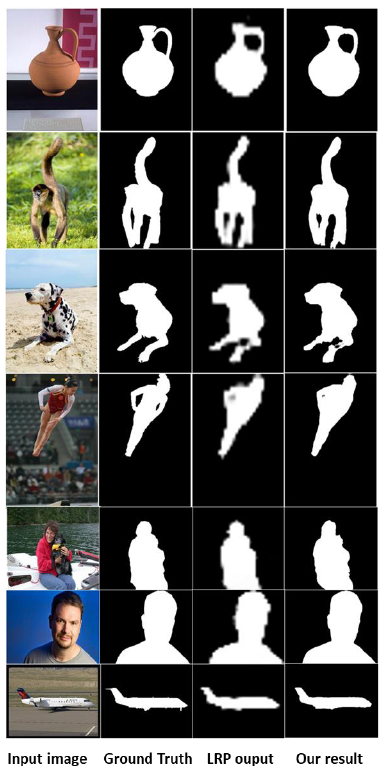

# HQ_SOD_repo
High-Quality Saliency Object Detection repository using FCN and DKN,
by Avia Israeli and Omri Levi (TAU, Deep Learning by Raja Giryes, 0510-7255, Fall 2019).

Project full report can be found here: https://drive.google.com/file/d/1AEF89GNBrMD5KdLUGSAbhaeC0AqNyRVS/view?usp=sharing

## 1. Introduction:
This repository includes the code for training and testing the high-quality, yet light-weight, SOD model
described in the paper. It consist of main models:
- LRP [1] - Low-Resolution Predictor module.
- DKN [2] - Deformable Kernel Networks - the joint-filtering refinement module.
- Full SOD module.
This repository is for personal educational use only.

## 2. Dataset:
Download DUTS [3] dataset from here: http://saliencydetection.net/duts/
The dataset should contain 2 folders: DUTS-TR, DUTS-TE for training and testing.
Every folder should contain 2 sub-folders: DUTS-TR-Image and DUTS-TR-Mask for training (or DUTS-TE-Image and DUTS-TE-Mask for testing).
In order to use the default path (as defined in our code) put the dataset in a different folder from the repository named "datasets"
or use your own path.

## 3. Pre-trained weights:
Download pre-trained weights from here: https://drive.google.com/open?id=1sRoEUvwg5CLxHigHnx4I1-XADsSQuXny
Extract the files to "HQ_SOD_repo/saved_models/"
(DKN parameters are already included in the repository in HQ_SOD_repo/DKN/saved_model or HQ_SOD_repo/DKN/parameter).

## 4. Requirements:
Use the yml file (HQ_SOD_repo/environment_requirements.yml) to see the requirements (we recommend setting the environment via anaconda).

## 5. How to run:
Every model can be either trained or tested. The training process can begin from scratch or from pre-trained parameters.
For training, change the relevant variables in the parser or use the defaults.
For testing, change the relevant variables according to your parameters and inputs paths.

### 5.1. LRP
	- Inference: run HQ_SOD_repo/LRP/train_unet_upsampled_model.py - change the parameter "--b_train" to False and make sure the path to the pre-trained parameters in "--parameter" is correct
	- Train: run HQ_SOD_repo/LRP/train_unet_upsampled_model.py - change the parameter "--b_train" to True. For training from scratch use "--parameter" value "None".
	
### 5.2. DKN
	- Inference: run HQ_SOD_repo/DKN/dkn_inference.py - change the "--rgb_folder" and "--mask_folder" for the correct paths (or use defaults), change image name "--image_name"
	- Train: run HQ_SOD_repo/DKN/dkn_train.py - make sure "--train_guide_dir" and "--test_guide_dir" are correct.
	
### 5.3. Full SOD model
	- Inference: run HQ_SOD_repo/inference_full_sod_model.py - make a list of image names in "input_images" and make sure the paths input image directory and output image directory in "--rgb_folder" and "--mask_folder" are correct. Make sure the path for the pre-trained parameters in "--merged_model_params" is correct.
	- Train: run HQ_SOD_repo/train_full_sod_model.py - make sure "--train_input_images_dir" and "--test_input_images_dir" are correct. Make sure the path for the pre-trained parameters in "--pre_trained_full_network_params" is correct.

## 6. Credits and References:
- [1] - Inspired by https://github.com/ternaus/TernausNet/blob/master/unet_models.py
- [2] - DKN Github pytorch - https://github.com/jun0kim/DKN
- [3] - DUTS dataset - http://saliencydetection.net/duts/ - Lijun Wang, Huchuan Lu, Yifan Wang ,Mengyang Feng, Dong Wang, Baocai Yin, Xiang Ruan, "Learning to Detect Salient Objects with Image-level Supervision", CVPR2017
